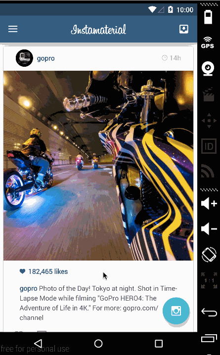

# Material Design Instagram Android app Demo

This is a material design Android demo application for showing custom animations in Android Lollipop. 

See [froger_mac dev blog](http://frogermcs.github.io/) for step-by-step tutorial.

Features:

 * [x] Android 5.0 RecycleView
 * [x] Android 5.0 CardView
 * [x] Android 5.0 Material Design Toolbar
 * [x] Ripple Effects
 * [x] Custom activity transition animations
 

GIF created with [LiceCap](http://www.cockos.com/licecap/).
